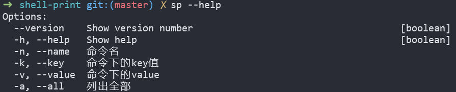
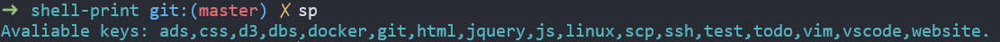
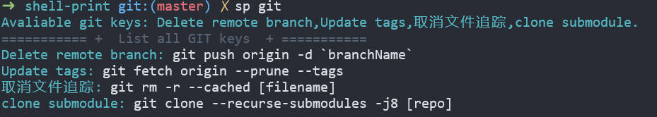

# Shell Print

一款基于 Node.js 的命令行工具，可将配置在`db/*`目录下的数据打印在终端显示。

## 开始使用

```bash
npm install
npm link
```

> 默认触发命令为`sp`，可在`package.json`中的`bin`内自定义配置，然后执行`npm link`重新绑定。

## 常用命令

- 帮助


- 列出所有条目


- 列出某个条目的内容

